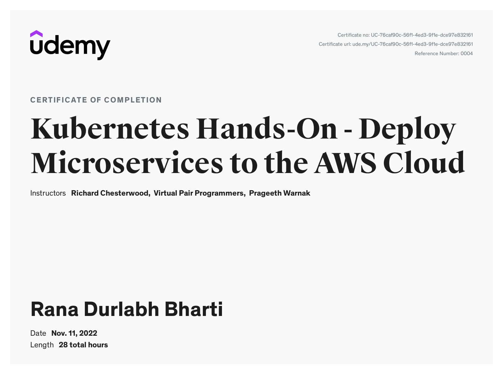

# Kubernetes-Hands-On---Deploy-Microservices-to-the-AWS-Cloud

This is a reources repository of my learning of Udemy Course ["Kubernetes-Hands-On---Deploy-Microservices-to-the-AWS-Cloud"](https://www.udemy.com/course/kubernetes-microservices/)

# Course Completion Certificate

## Outline

-   Deploy containers to a Kubernetes Cluster
-   Run Kubernetes in AWS using either EKS or Kops
-   Monitor a live Kubernetes cluster using Prometheus and Grafana
-   Analyse system-wide logs using the ELK Stack (ElasticStack); Kibana and ElasticSearch
-   Handle Alerts in a Kubernetes cluster by notifying Slack Channels
-   Understand how Requests and Limits work in Kubernetes
-   Use Kubernetes Horizontal Pod Autoscaling
-   Configure Ingress Control on a live Kubernetes deployment
-   Understand Kubernetes StatefulSets
-   Integrate Kubernetes with a Continuous Deployment System (CD)
-   Use Helm to Manage Charts and to Dynamically Update your Kubernetes YAML
